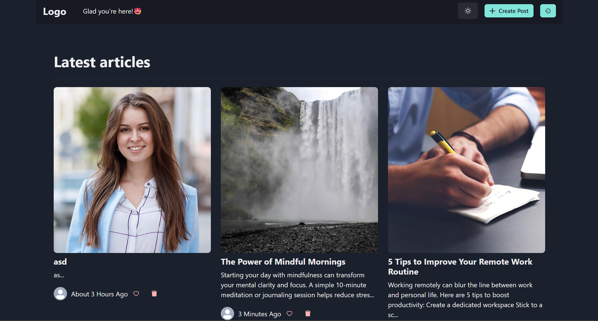

# Blog App


A simple blog application that allows users to create, read, update, and delete blog posts. This project demonstrates a full-stack web application using modern technologies.

## Tech Stack

- **Frontend:** React.js
- **Backend:** Node.js, Express.js
- **Database:** MongoDB
- **Styling:** CSS/SCSS or styled-components (customizable)
- **API Testing:** Postman or similar tools

## Features

- User authentication (register/login)
- Create, edit, and delete blog posts
- View all posts and individual post details
- Responsive design

## Setup Instructions

1. **Clone the repository:**
   ```bash
   git clone https://github.com/your-username/blog-app.git
   cd blog-app
   ```

2. **Backend Setup:**
   - Navigate to the backend folder:
     ```bash
     cd backend
     ```
   - Install dependencies:
     ```bash
     npm install
     ```
   - Create a `.env` file and add your MongoDB URI and other environment variables.
   - Start the backend server:
     ```bash
     npm start
     ```

3. **Frontend Setup:**
   - Open a new terminal and navigate to the frontend folder:
     ```bash
     cd frontend
     ```
   - Install dependencies:
     ```bash
     npm install
     ```
   - Start the frontend development server:
     ```bash
     npm start
     ```

4. **Access the App:**
   - Open your browser and go to `http://localhost:3000`

## Contributing

Pull requests are welcome. For major changes, please open an issue first to discuss what you would like to change.

## License

This project is licensed under the MIT License.
